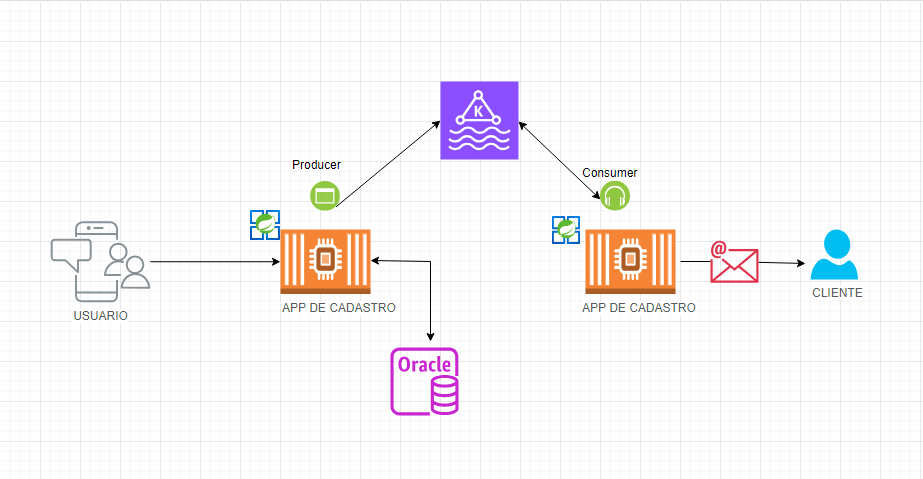

# Projeto: Cadastro de usuario ultilizando kafka e serviço de notificação

Este projeto é uma aplicação Java/Spring que utiliza **Kafka** para gerenciar um fluxo de **cadastro de usuários**. Ele envia os dados de registro para o Kafka, onde um **Producer** serializa os dados do usuário e um **Consumer** os consome. Se houver erros durante o processamento da mensagem, um sistema de tratamento de erros com **retries** (tentativas) e **DLT (Dead Letter Topic)** é implementado para garantir que as mensagens com falhas sejam armazenadas para análise posterior.

# Arquitetura proposta

# Tecnologias usadas
- **Java 11**
- **Spring boot**
- **Apache Kafka**
- **Jackson (para serialização/deserialização)**
- **Docker (opcional, para rodar o Kafka localmente)**
# Explicando o Fluxo
Conforme visto na arquitetura, nosso projeto possui duas aplicações: a de cadastro de usuário e a de notificação. A aplicação de cadastro de usuário é responsável por registrar o usuário, armazenando seus dados em um banco MySQL, e em seguida, enviar um evento ao Kafka com algumas informações do usuário cadastrado. Essa mensagem será consumida pela API de notificação, que será responsável por enviar um e-mail de boas-vindas ao cliente.

# Estrutura do projeto
### 1. Producer
O **Producer** serializa o objeto `Evento` (que contém os dados do usuário) para **bytes** usando o `EventoSerializer`. Ele então envia a mensagem para o **Kafka Broker**, onde ela é armazenada em um tópico Kafka (`notificacao-usuario`).

### 2. Kafka Broker
O **Kafka Broker** recebe e armazena a mensagem no tópico `notificacao-usuario`. Este broker é responsável por gerenciar o fluxo de mensagens entre o **Producer** e o **Consumer**.

### 3. Consumer
O **Consumer** consome as mensagens do tópico `notificacao-usuario` e usa o `EventoDeserializer` para desserializar os bytes de volta para um objeto `Evento`.

- **Sucesso**: Se o processamento for bem-sucedido, uma notificação (e-mail ou outra) é enviada ao usuário.
- **Erro**: Se o consumidor encontrar um erro, o sistema tentará processar a mensagem 3 vezes com intervalos de 1 segundo entre cada tentativa.

### 4. Dead Letter Topic (DLT)
Se todas as tentativas falharem, a mensagem será enviada para um **Dead Letter Topic (DLT)** chamado `notificacao-usuario-dlt`. A mensagem será enviada com um histórico de erro adicionado, permitindo a análise posterior da falha.

# Execução do projeto
Para realizar a execução do projeto será necessário:
- **Docker**

Para rodar o projeto você pode usar o comando:
- `docker-compose up --build -d`
